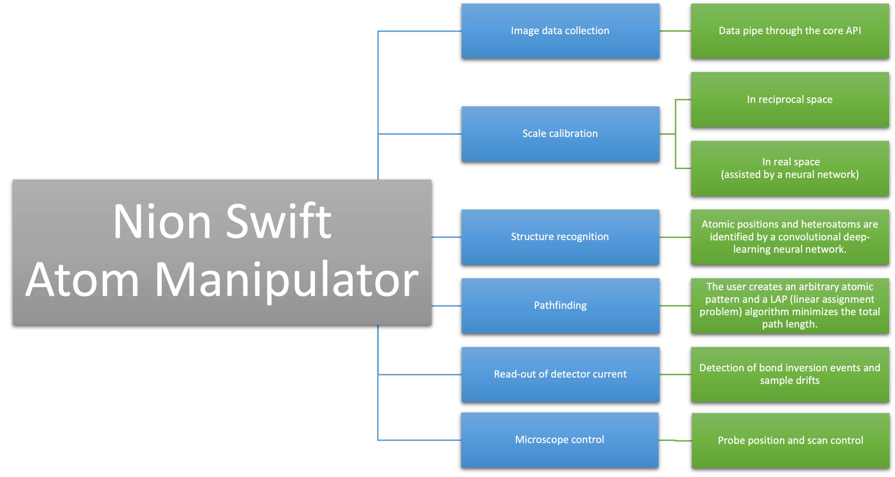
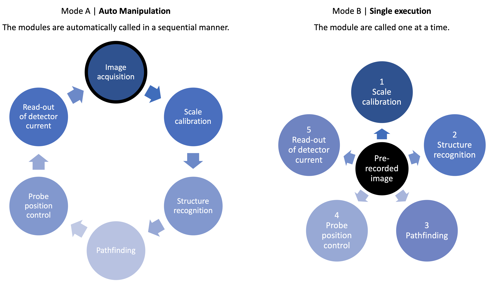
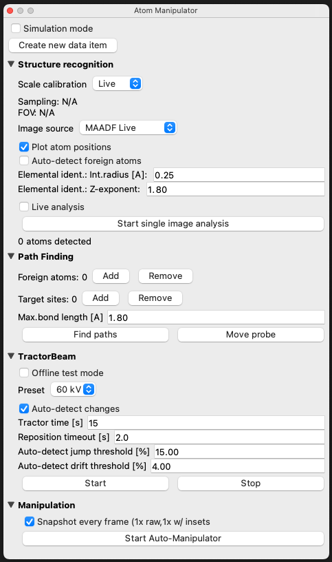

# nionswift_atom_manipulator

Single-atom manipulation tool for Nion Swift

-----
**Installation**
--

1. Install the required Python packages, which are listed below (see also requirements.txt). These will not be installed by executing the provided setup.py.
- numpy
- scipy
- matplotlib
- scikit-image
- double_gaussian_blur (see https://github.com/arpostl/double_gaussian_blur)
- fourier_scale_calibration (see https://github.com/jacobjma/fourier-scale-calibration)
- nionswift_structure_recognition (see https://github.com/jacobjma/nionswift-structure-recognition)
- nionswift_univie_tractorbeam (see [T.B.A.])
- OPTIONAL: periodictable

2. In a terminal (Linux, MacOS) or command prompt (Windows) window, navigate to the root folder of this package.

3. Install this package by executing the provided setup.py:
```
$ python3 ./setup.py install
```
or
```
$ pip3 install .
```

-----
**Infographics**
--

--


-----
**Screenshot**
--


-----
**Acknowledgements**
--

Cordial thanks for coding and support go to
- Toma Susi (https://github.com/TomaSusi)
- Jacob Madsen (https://github.com/jacobjma)
- Andreas Mittelberger (https://github.com/Brow71189)
- Christoph Hofer (https://github.com/christophhofer40)
- Nion company (https://github.com/nion-software)
