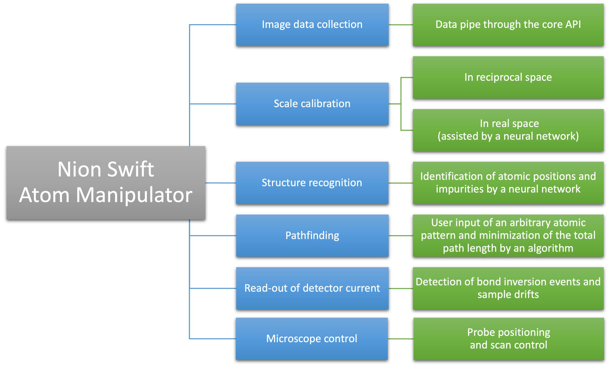
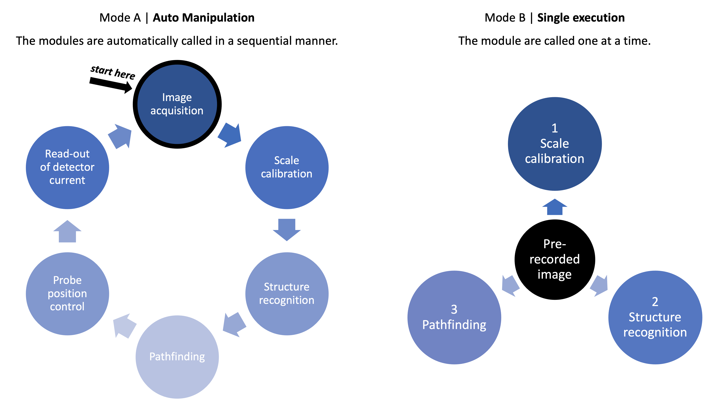

# nionswift_atom_manipulator

Single-atom manipulation tool for Nion Swift

-----
**Prerequisites**
--
Anaconda/Miniconda Python 3.8 environment with Nion Swift installed (see https://nionswift.readthedocs.io/en/stable/installation.html)

-----
**Installation**
--

1. Activate your Anaconda/Miniconda environment with Nion Swift installed (see prerequisites).
2. Install the conda packages listed below. These will not be installed in step 5 as dependencies.
    - numpy
    - scipy
    - matplotlib
    - scikit-image
3. *(optional: enables element identification)* Install the pip package periodictable.
4. Install the non-conda packages listed below. These will not be installed in step 5 as dependencies.
    - double_gaussian_blur (see https://github.com/arpostl/double_gaussian_blur)
    - fourier_scale_calibration (see https://github.com/jacobjma/fourier-scale-calibration)
    - nionswift_structure_recognition (see https://github.com/jacobjma/nionswift-structure-recognition)
    - nionswift_univie_tractorbeam (see [T.B.A.])
    - *(optional: enables simulation mode)* nionswift-usim (fork, see https://github.com/jacobjma/nionswift-usim)

5. Install this package by executing the provided setup.py. The following commands are valid if in a terminal (Linux, MacOS) or command prompt (Windows) and navigated to the root folder of this package.
```
$ python3 ./setup.py install
```
or
```
$ pip3 install .
```

-----
**Infographics**
--

--


-----
**Screenshot of GUI**
--


-----
**Acknowledgements**
--

Cordial thanks for coding and support go to
- Toma Susi (https://github.com/TomaSusi)
- Jacob Madsen (https://github.com/jacobjma)
- Andreas Mittelberger (https://github.com/Brow71189)
- Christoph Hofer (https://github.com/christophhofer40)
- Nion company (https://github.com/nion-software)
